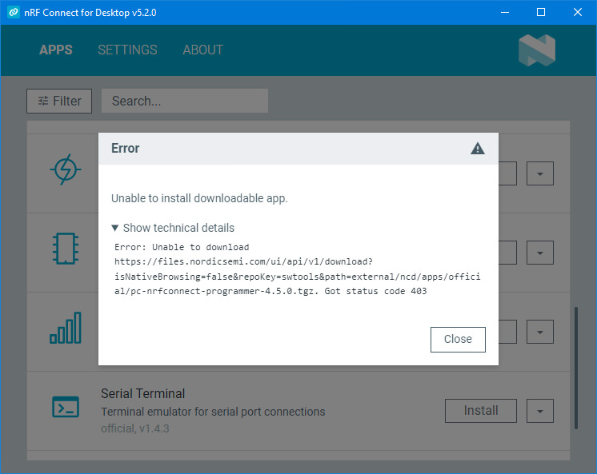
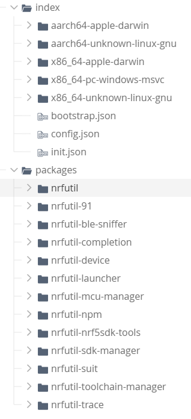

# Manual installation, configuration, and use of nRFUtil and its packages
  
If we cannot access the resource on the domain *https://files.nordicsemi.com/* (403 Forbidden) and, therefore, cannot use standard tools from Nordic Semiconductor (for example, nRF Connect for Desktop Apps),  

  
we can use the [Chinese "mirror"](https://files.nordicsemi.cn/ui/packages).  
[nRF Util branch](https://files.nordicsemi.cn/ui/repos/tree/General/swtools/external/nrfutil)  
  
  

### Run nRF Util
~~~  
nrfutil
~~~
Possible error:  
  
> Error: Failed to bootstrap core functionality before executing command.  
> HTTP request to default bootstrap resource:  
> https://files.nordicsemi.com/artifactory/swtools/external/nrfutil/index/bootstrap.json  
> failed with HTTP code: 403 Forbidden.  
> Please check that your internet connection is functioning. If you use a proxy, please try the --detect-proxy flag or manually set the appropriate HTTP_PROXY-style environment variable(s).  
> To use a custom bootstrap config, set NRFUTIL_BOOTSTRAP_CONFIG_URL.  
> To bootstrap directly from a nrfutil-core package tarball, set NRFUTIL_BOOTSTRAP_TARBALL_PATH.  
  
### Get original bootstrap.json
[Original bootstrap.json](https://files.nordicsemi.cn/ui/repos/tree/General/swtools-cache/external/nrfutil/index/bootstrap.json)  
~~~
{
  "nrfutil_core_tarball_urls": {
    "aarch64-apple-darwin": "https://files.nordicsemi.com/artifactory/swtools/external/nrfutil/packages/nrfutil/nrfutil-aarch64-apple-darwin-8.0.0.tar.gz",
    "x86_64-apple-darwin": "https://files.nordicsemi.com/artifactory/swtools/external/nrfutil/packages/nrfutil/nrfutil-x86_64-apple-darwin-8.0.0.tar.gz",
    "x86_64-pc-windows-msvc": "https://files.nordicsemi.com/artifactory/swtools/external/nrfutil/packages/nrfutil/nrfutil-x86_64-pc-windows-msvc-8.0.0.tar.gz",
    "x86_64-unknown-linux-gnu": "https://files.nordicsemi.com/artifactory/swtools/external/nrfutil/packages/nrfutil/nrfutil-x86_64-unknown-linux-gnu-8.0.0.tar.gz",
    "aarch64-unknown-linux-gnu": "https://files.nordicsemi.com/artifactory/swtools/external/nrfutil/packages/nrfutil/nrfutil-aarch64-unknown-linux-gnu-8.0.0.tar.gz"
  }
}
~~~
There may be problems downloading the tarball if access to *files.nordicsemi.com* resources is denied.  

### Download nrfutil core tarball
[nrfutil-x86_64-pc-windows-msvc-8.1.1.tar.gz](https://files.nordicsemi.cn/ui/native/swtools-cache/external/nrfutil/packages/nrfutil/nrfutil-x86_64-pc-windows-msvc-8.1.1.tar.gz)
  
and put it to another web server (http://localhost, for instance):
~~~
{
  "nrfutil_core_tarball_urls": {
    "x86_64-pc-windows-msvc":    "https://mozolin.info/nrfutil/nrfutil-x86_64-pc-windows-msvc-8.1.1.tar.gz"
  }
}
~~~

### Make and run script
Run commands => files will be saved in C:\\Users\\[username]\\.nrfutil:  
~~~
@echo off
set NRFUTIL_BOOTSTRAP_CONFIG_URL=https://mozolin.info/nrfutil/bootstrap.json
nrfutil > nrfutil.txt
~~~
If the script is successfully executed, the folder C:\\Users\\[username]\\.nrfutil will be created.  
Check, if nRF Util is istalled by getting its version:  
~~~
nrfutil -V
~~~
> nrfutil 8.1.1 (b6089d0 2025-08-21)  
> commit-hash: b6089d08a9cfdb292f8ab8d21e0908ded814cd11  
> commit-date: 2025-08-21  
> host: x86_64-pc-windows-msvc  
> build-timestamp: 2025-08-21T14:12:43.593658000Z  
> classification: nrf-external  

### Download nRF Util packages
[nRF Util packages](https://files.nordicsemi.cn/ui/repos/tree/General/swtools/external/nrfutil/packages)

### Install nRF Util packages
~~~  
nrfutil install pkg
~~~
Possible error:  
  
> Error: Failed to query for package 'nrfutil-pkg' on package index - aborting before uninstall  
> Caused by:  
> HTTP request to 'https://files.nordicsemi.com/artifactory/swtools/external/nrfutil/index/x86_64-pc-windows-msvc/nrfutil-pkg' was unsuccessful. Status code: **403 Forbidden**  

Possible error:  
~~~
nrfutil pkg
~~~
> Error: nrfutil command `pkg` not found. See `nrfutil list` for full list of installed commands, `nrfutil search` for installable commands, and `nrfutil install` for installation of new commands.  
> Caused by:  
> Subcommand nrfutil-pkg.exe not found  

1) Unpack "nrfutil-nrf5sdk-tools" package (nrfutil-nrf5sdk-tools-x86_64-pc-windows-msvc-1.1.0.tar.gz)
2) Put a copy of nrfutil-nrf5sdk-tools-x86_64-pc-windows-msvc-1.1.0 folder to C:\\Users\\[username]\\.nrfutil\\installed
3) Move the contents of the nrfutil-nrf5sdk-tools-x86_64-pc-windows-msvc-1.1.0/data folder to C:\\Users\\[username]\\.nrfutil:
   - Adds the contents of the bin folder to the existing bin folder
   - Adds the lib folder
   - Adds the contents of the share folder to the existing share folder
4) Correct the file paths in the C:\\Users\\[username]\\.nrfutil\\installed\\nrfutil-nrf5sdk-tools-x86_64-pc-windows-msvc-1.1.0\\files settings (replace "data/" with "../../")
~~~
Filepath,Checksum
../../bin/nrfutil-dfu.exe,b0adce8dcadc7efeb5e413b84300dd37d2fcc526647529561c4317caf2fcb4dd
../../bin/nrfutil-keys.exe,3418fc195cebbe9e39a6664b5b1864f9326e322cf5dba9e78e502f4fc576d06c
../../bin/nrfutil-nrf5sdk-tools.exe,5dd5cb31ab9e65d17b59cc9f751d41f92f245de9472c16dc0fdda979610f782b
../../bin/nrfutil-pkg.exe,9c495bef81abd6aa03c0bf4f053a59ecba25d6c947e9b1ea55fc22365b07a140
../../bin/nrfutil-settings.exe,ff89e7933c4fc26273c3942423b4f9d326bb4739aa6f5b1f4456b670699ea873
../../bin/nrfutil-zigbee.exe,bf2defe93d41703108980f2fde12a2b837d93b22dfacecb493cc03bcacd7c356
../../lib/nrfutil-nrf5sdk-tools/pc_nrfutil_legacy_v6.1.7.exe,bac531e6781b9ab7a6bfccb519c8ee7a15b11ecf13140bb058cc7bb0cdc6d802
../../share/doc/nrfutil-nrf5sdk-tools/html/index.html,732c73d465122a04362635a884b79a44fe4645c0e35e6aa9da988efafc3a1a31
../../share/doc/nrfutil-nrf5sdk-tools/html/style.css,399b06d522d7ee9b8163e251697ce215fab063c242bbad17847130f9d991774f
../../share/doc/nrfutil-nrf5sdk-tools/md/index.md,497199adbd85f1778bde125370195dab9520d3bed24a55e422fb685c105124d3
../../share/nrfutil-nrf5sdk-tools/LICENSE,a2d699173aac0450b26b423acda8e589d5d4a1c3bd1d5653a3eb8bbd9b9f31b4
manifest.json,a7d898ded77381a448d8902b72c94071d191baf996762aeceba360763d55b01b
~~~
  
Check if the problem is resolved:
~~~
nrfutil pkg
~~~
>Usage: pc_nrfutil_legacy_v6.1.7.exe pkg [OPTIONS] COMMAND [ARGS]...  
>  This set of commands supports Nordic DFU package generation.  
>Options:  
>  --help  Show this message and exit.  
>Commands:  
>  display   Display the contents of a .zip package file.  
>  generate  Generate a zip file for performing DFU.  

Do the same for the "nrfutil-sdk-manager" package, which is also needed to create and load firmware onto the nRF52840 USB Dongle.  

  
# Contents
- [Installing nRF Util and its packages](01_nrfutil.md)  
- [Creating RCP firmware for the nRF52840 USB Dongle](02_firmware.md)  
- [Installing and Configuring OTBR on Ubuntu](03_otbr.md)  
- [Some links](04_links.md)  
  