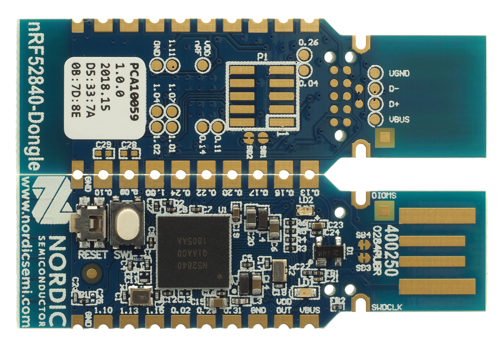
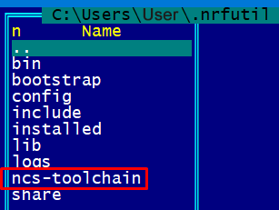
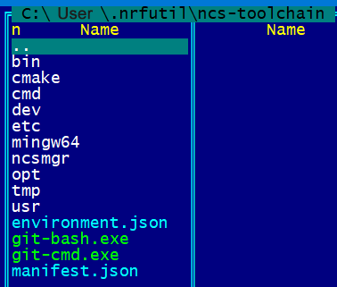
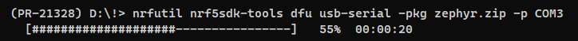
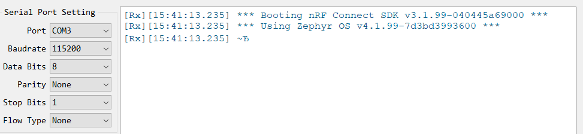
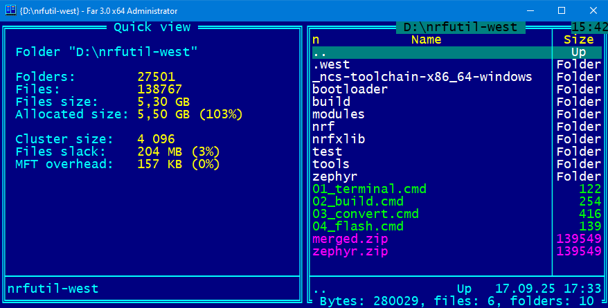

# How to create RCP Firmware for the nRF52840 USB Dongle using nrfutil and west (Windows)

### 1) Links
**"Configuring radio co-processor"**  
[https://docs.nordicsemi.com/bundle/ncs-latest/page/nrf/protocols/thread/tools.html#configuring_a_radio_co-processor](https://docs.nordicsemi.com/bundle/ncs-latest/page/nrf/protocols/thread/tools.html#configuring_a_radio_co-processor)  

**"Installing west"**  
[https://docs.zephyrproject.org/latest/develop/west/install.html](https://docs.zephyrproject.org/latest/develop/west/install.html)  

### 2) Install west
~~~
pip3 install -U west
~~~

### 3) Find the ncs-toolchain version in config.json
[config.json](https://files.nordicsemi.cn/ui/repos/tree/General/NCS/external/bundles/config.json)  
For example, "ncs-toolchain-x86_64-windows-0b393f9e1b.tar.gz"  

### 4) Download ncs-toolchain and unzip it
[ncs-toolchain-x86_64-windows](https://publicburan.blob.core.windows.net/artifactory/NCS/external/bundles/v3/ncs-toolchain-x86_64-windows-0b393f9e1b.tar.gz)  
For example, in C:\\Users\\[username]\\.nrfutil\\ncs-toolchain:  
  
  
  
  

The path where ncs-toolchain is located can be anything else!  
  
### 5) Launch the terminal
~~~
nrfutil sdk-manager toolchain launch --toolchain-path "C:\Users\[username]\.nrfutil\ncs-toolchain" --terminal
~~~
or
~~~
nrfutil sdk-manager toolchain launch --toolchain-path "The_path_where_ncs-toolchain_is_located" --terminal
~~~

**All other scripts/programs are executed from the running Powershell terminal...**  

### 6) Install nRF Connect SDK
~~~
west init -m https://github.com/nrfconnect/sdk-nrf
west update
~~~

### 7) Build the Thread: Co-processor sample
~~~
west build -p always -b nrf52840dongle/nrf52840 nrf/samples/openthread/coprocessor/
~~~
~~~
Memory region      Used Size  Region Size  %age Used
        FLASH:      139020 B       988 KB     13.74%
          RAM:       36544 B       256 KB     13.94%
     IDT_LIST:          0 GB        32 KB      0.00%
Generating ../merged.hex
~~~
The *merged.hex* file will be located in the *build/* folder.  
The *zephyr.hex* file will be located in the *build/coprocessor/zephyr/* folder.  
Both files contain the correct RCP firmware for the nRF52840 USB Dongle.  

### 8) Generate the RCP firmware package
~~~
nrfutil nrf5sdk-tools pkg generate --hw-version 52 --sd-req=0x00  --application build/merged.hex --application-version 1 merged.zip
nrfutil nrf5sdk-tools pkg generate --hw-version 52 --sd-req=0x00  --application build/coprocessor/zephyr/zephyr.hex --application-version 1 zephyr.zip
~~~
~~~
|===============================================================|
|##      ##    ###    ########  ##    ## #### ##    ##  ######  |
|##  ##  ##   ## ##   ##     ## ###   ##  ##  ###   ## ##    ## |
|##  ##  ##  ##   ##  ##     ## ####  ##  ##  ####  ## ##       |
|##  ##  ## ##     ## ########  ## ## ##  ##  ## ## ## ##   ####|
|##  ##  ## ######### ##   ##   ##  ####  ##  ##  #### ##    ## |
|##  ##  ## ##     ## ##    ##  ##   ###  ##  ##   ### ##    ## |
| ###  ###  ##     ## ##     ## ##    ## #### ##    ##  ######  |
|===============================================================|
|You are not providing a signature key, which means the DFU     |
|files will not be signed, and are vulnerable to tampering.     |
|This is only compatible with a signature-less bootloader and is|
|not suitable for production environments.                      |
|===============================================================|
Zip created at merged.zip
~~~

### 9) Set nRF52840 Dongle
Connect the nRF52840 Dongle to the USB port. Press the RESET button on the dongle to put it into the DFU mode. The LED on the dongle starts blinking red.

### 10) Install firmware
Install the RCP firmware package onto the dongle by running the following command, with `COM3` replaced with the device node name of your nRF52840 Dongle
~~~
nrfutil nrf5sdk-tools dfu usb-serial -pkg merged.zip -p COM3
~~~
or  
~~~
nrfutil nrf5sdk-tools dfu usb-serial -pkg zephyr.zip -p COM3
~~~
We can see the firmware process:  
  
  
  
We can check the firmware's functionality using the Terminal Serial Port:  
    
  
  
This is an example of what the ncs_toolchain folder structure might look like for flashing the nRF52840 as an RCP:  
  
  

  
# Contents
- [Installing nRF Util and its packages](01_nrfutil.md)  
- [Creating RCP firmware for the nRF52840 USB Dongle](02_firmware.md)  
- [Installing and Configuring OTBR on Ubuntu](03_otbr.md)  
- [Some links](04_links.md)  
  