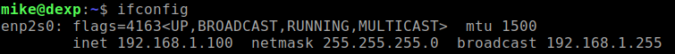
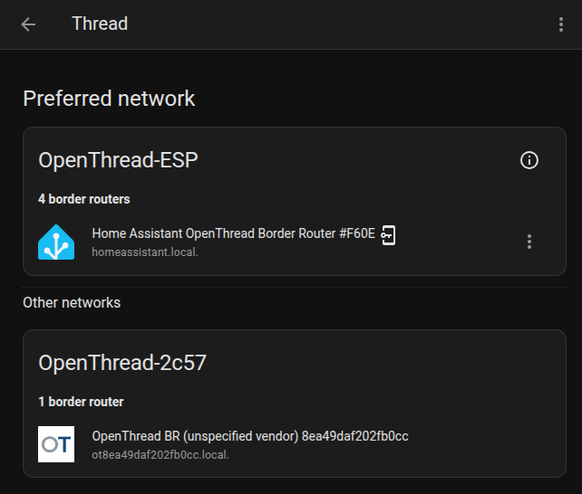
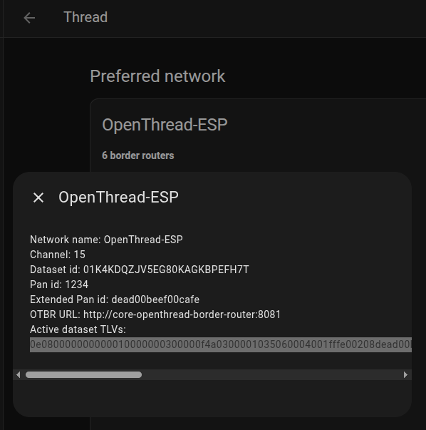
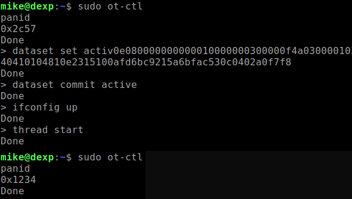
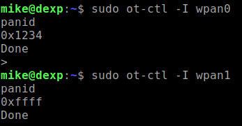
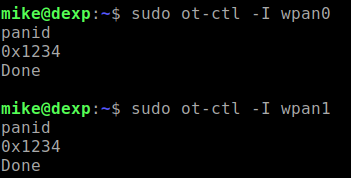
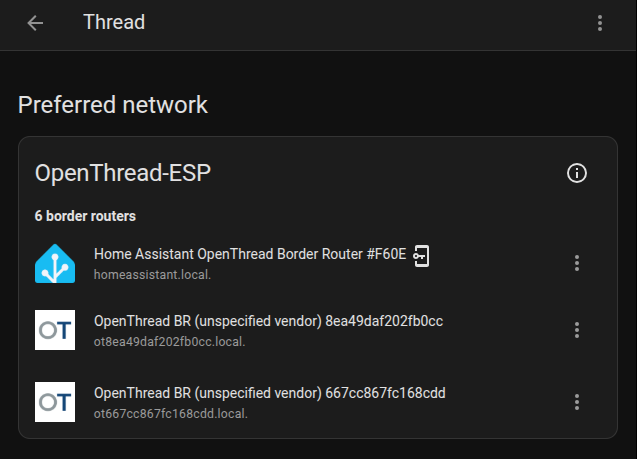

# Installing and Configuring OTBR on Ubuntu

### 1) Links
**"Native Install"**  
[https://openthread.io/guides/border-router/build-native](https://openthread.io/guides/border-router/build-native)  
  
**"Form Thread Network"**  
[https://openthread.io/guides/border-router/form-network](https://openthread.io/guides/border-router/form-network)  

### 2) OTBR Default Settings
Clone ot-br-posix from GitHub:
~~~
git clone --depth=1 https://github.com/openthread/ot-br-posix
~~~
Get a list of interfaces used by Ubuntu:
~~~
ifconfig
~~~
We will be interested in Ethernet:  
  
  
  
Set up the Thread Border Router:
~~~
cd ot-br-posix
./script/bootstrap
INFRA_IF_NAME=enp2s0 ./script/setup
~~~
OTBR created a new Thread network, OpenThread-2c57:  
  
  

We will join the new OTBR to the existing Thread network. In the Home Assistant "Thread" integration, copy the "Active dataset TLVs" value.  
  
  
  
In the terminal, check the current network PanID - it's 0x2c57. Join the existing Thread network by running a few commands. Then, check the PanID again - it'll be 0x1234, the existing network's PanID.  
  
  
  
~~~
sudo ot_ctl
~~~
~~~
panid
dataset set active 0e080000000000010000000300000f4a0300001035060004001fffe00208dead00beef00cafe0708fd000db800a00000051000112233445566778899aabbccddeeff030e4f70656e5468726561642d455350010212340410104810e2315100afd6bc9215a6bfac530c0402a0f7f8
dataset commit active
ifconfig up
thread start
~~~

### 3) Installing a second instance of OTBR

Create/change settings for the first OTBR instance:  
- [otbr-agent.service](ubuntu/usr/lib/systemd/system/otbr-agent.service)
> \[Unit\]  
> Description=***OpenThread Border Router Agent***  
> \[Service\]  
> EnvironmentFile=-/etc/default/***otbr-agent***  
> \[Install\]  
> Alias=***otbr-agent***.service  
- [otbr-web.service](ubuntu/usr/lib/systemd/system/otbr-web.service)
> \[Unit\]  
> Description=***Border Router Web***  
> After=***otbr-agent***.service  
> \[Service\]  
> EnvironmentFile=-/etc/default/***otbr-web***  
> \[Install\]  
> Alias=***otbr-web***.service  
- [otbr-agent](ubuntu/etc/default/otbr-agent)
> OTBR_AGENT_OPTS="-I ***wpan0*** -B enp2s0 spinel+hdlc+uart://***/dev/ttyACM0*** trel://enp2s0"  
> OTBR_AGENT_PORT=***10001***  
- [otbr-web](ubuntu/etc/default/otbr-web)
> OTBR_WEB_OPTS="-d 0 -p ***8181*** -a 0.0.0.0"  
> OTBR_WEB_PORT=***8181***  

Create/change settings for the second OTBR instance:  
- [otbr-agent-2.service](ubuntu/usr/lib/systemd/system/otbr-agent-2.service) + create a symlink /etc/systemd/system/otbr-agent-2.service  
> \[Unit\]  
> Description=***OpenThread Border Router Agent 2***  
> \[Service\]  
> EnvironmentFile=-/etc/default/***otbr-agent-2***  
> \[Install\]  
> Alias=***otbr-agent-2***.service  
- [otbr-web-2.service](ubuntu/usr/lib/systemd/system/otbr-web-2.service) + create a symlink /etc/systemd/system/otbr-web-2.service  
> \[Unit\]  
> Description=***Border Router Web 2***  
> After=***otbr-agent-2***.service  
> \[Service\]  
> EnvironmentFile=-/etc/default/***otbr-web-2***  
> \[Install\]  
> Alias=***otbr-web-2***.service  
- [otbr-agent-2](ubuntu/etc/default/otbr-agent-2)  
> OTBR_AGENT_OPTS="-I ***wpan1*** -B enp2s0 spinel+hdlc+uart://***/dev/ttyACM1*** trel://enp2s0"  
> OTBR_AGENT_PORT=***10002***  
- [otbr-web-2](ubuntu/etc/default/otbr-web-2)  
> OTBR_WEB_OPTS="-d 0 -p ***8282*** -a 0.0.0.0"  
> OTBR_WEB_PORT=***8282***  
  
***Differences in the configurations of the first and second OTBR copies are highlighted in bold italics.***  
  
We will join a second OTBR instance to the existing Thread network. In the Home Assistant "Thread" integration, copy the "Active dataset TLVs" value and run a few commands in the terminal (see above).  
  
  
~~~
sudo ot-ctl -I wpan0

sudo ot-ctl -I wpan1
~~~
  
Let's check the PanID of the second OTBR instance - it will also be equal to 0x1234, that is, the PanID of the existing network.  
  
  
  
As a result, we can verify that the second OTBR instance is also in the existing Thread network.  
  
  
  
Add the otbr-agent-2 service to startup:
~~~
sudo systemctl enable otbr-agent-2
~~~
> Created symlink /etc/systemd/system/multi-user.target.wants/otbr-agent-2.service → /usr/lib/systemd/system/otbr-agent-2.service.  
  
Check it:
~~~
sudo systemctl is-enabled otbr-agent-2
~~~
> enabled  

    
Add the otbr-web-2 service to startup:
~~~
sudo systemctl enable otbr-web-2
~~~
> Created symlink /etc/systemd/system/multi-user.target.wants/otbr-web-2.service → /usr/lib/systemd/system/otbr-web-2.service.  
  
Check it:
~~~
sudo systemctl is-enabled otbr-web-2
~~~
> enabled  

    
  
# Contents
- [Installing nRF Util and its packages](01_nrfutil.md)  
- [Creating RCP firmware for the nRF52840 USB Dongle](02_firmware.md)  
- [Installing and Configuring OTBR on Ubuntu](03_otbr.md)  
- [Some links](04_links.md)  
  