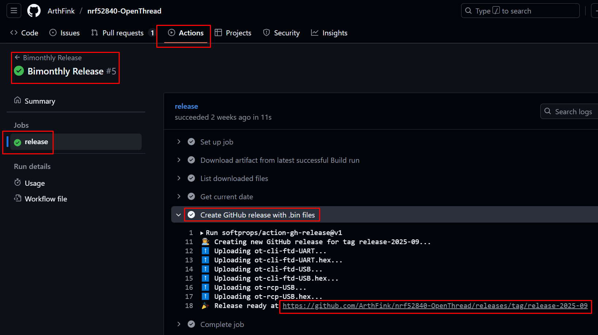

# Documentation
**1) OpenThread Border Router**  
[https://openthread.io/guides/border-router/prepare](https://openthread.io/guides/border-router/prepare)  
Used:  
- Raspberry Pi (Thread border router)  
- nRF52840 USB Dongle (RCP)  
- nRF52840 USB Dongle (End device)  
  
**2) Build a Thread network with nRF52840 boards and OpenThread**  
[https://openthread.io/codelabs/openthread-hardware#1](https://openthread.io/codelabs/openthread-hardware#1)  
Used:  
- x86-based Linux (Ubuntu) machine (to serve as the host to a RCP and to flash all nRF52840 PDK boards)
- nRF52840 PDK boards (RCP and End devices)
  
Downloads (see "Software" section below):  
- Download J-Link Software and Documentation Pack: JLink_Linux_V864_x86_64.deb
- Download nRF5x Command Line Tools: nrf-command-line-tools_10.24.2_amd64.deb
- Download ARM GNU Toolchain portable archive: gcc-arm-none-eabi-10.3-2021.10-x86_64-linux.tar.bz2
- Download nRF Connect for Desktop: nrfconnect-5.2.0-x86_64.AppImage 
- Download nRF Util: nrfutil

 
**3) Configuring a radio co-processor**  
[https://docs.nordicsemi.com/bundle/ncs-latest/page/nrf/protocols/thread/tools.html#configuring_a_radio_co-processor](https://docs.nordicsemi.com/bundle/ncs-latest/page/nrf/protocols/thread/tools.html#configuring_a_radio_co-processor)  
  
Install WEST:  
[https://docs.zephyrproject.org/latest/develop/west/install.html](https://docs.zephyrproject.org/latest/develop/west/install.html)  
~~~
pip3 install --user -U west
~~~
It will be installed in the *~/.local/bin* folder, so we should check for it in *.profile*:  
~~~
if [ -d "$HOME/.local/bin" ] ; then
    PATH="$HOME/.local/bin:$PATH"
fi
~~~
When running \*.AppImage, an error may occur:  
> dlopen(): error loading libfuse.so.2  
  
This can be fixed by installing the library:
~~~
sudo apt install libfuse2
~~~
  
**4) How to Setup a OpenThread Border Router Using a NRF52840 USB Stick and Connect the Thread Sensor Tag**  
[https://www.instructables.com/How-to-Setup-a-OpenThread-Border-Router-Using-a-NR/](https://www.instructables.com/How-to-Setup-a-OpenThread-Border-Router-Using-a-NR/)  
[Local copy (.pdf)](links/How_to_setup_a_OTBR_using_a_NRF52840_USB_stick_and_connect_the_Thread_Sensor_Tag.pdf)  
Used:  
- Raspberry Pi 4 (Thread border router)  
- nRF52840 USB Dongle (RCP)  
- Thread Sensor Tag by open-things (End device)  

**5) Open Thread Border Router on Linux Ubuntu**  
*October 7, 2022*  
[https://www.hackster.io/skruglewicz/open-thread-border-router-on-linux-ubuntu-3d93d8](https://www.hackster.io/skruglewicz/open-thread-border-router-on-linux-ubuntu-3d93d8)  
[Local copy (.pdf)](links/OTBR_nRF52840_Dongle_on_Ubuntu.pdf)  
Used:  
- Nordic Semiconductor nRF52840 Dongle
- Ubuntu

# Software
[https://disk.yandex.ru/d/BH7Dl4UhqGjY9g](https://disk.yandex.ru/d/BH7Dl4UhqGjY9g)  
- gcc-arm-none-eabi-10.3-2021.10-x86_64-linux.tar.bz2  
- JLink_Linux_V864_x86_64.deb  
- nrf-command-line-tools_10.24.2_amd64.deb  
- nrfconnect-5.2.0-x86_64.AppImage 
- nrfutil   

# Firmware
OpenThread nRF52840 Firmware Builder:  
[https://github.com/ArthFink/nrf52840-OpenThread](https://github.com/ArthFink/nrf52840-OpenThread)  
1) Go to the "Actions" tab of this repository.  
2) Select the latest workflow run for the "Bimonthly Release" workflow.  
3) Select the "release" section  
4) Go to the "Create GitHub release with .bin files" link  
5) Click on the "Release ready at ..." link  
6) Choose appropriate binary ([ot-cli-ftd-USB.hex](links/ot-cli-ftd-USB.hex) - for instance)  
  
  
  
  
# Contents
- [Installing nRF Util and its packages](01_nrfutil.md)  
- [Creating RCP firmware for the nRF52840 USB Dongle](02_firmware.md)  
- [Installing and Configuring OTBR on Ubuntu](03_otbr.md)  
- [Some links](04_links.md)  
  