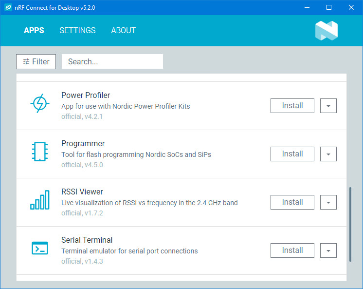

# Contents
- [Installing nRF Util and its packages](01_nrfutil.md)  
- [Creating RCP firmware for the nRF52840 USB Dongle](02_firmware.md)  
- [Installing and Configuring OTBR on Ubuntu](03_otbr.md)  
- [Some links](04_links.md)  
    
### Remarks
These articles describe the manual installation, configuration, and use of the nrfutil (Nordic Semiconductor) and west (Zephyr Project) utilities to create firmware for the nRF52840 module as an RCP for the OpenThread Border Router (OTBR), as well as the installation and configuration of OTBR itself (https://github.com/openthread/ot-br-posix) in Ubuntu. The first and second articles can be completed using the native "nRF Connect for Desktop" software (Nordic Semiconductor).  
  

